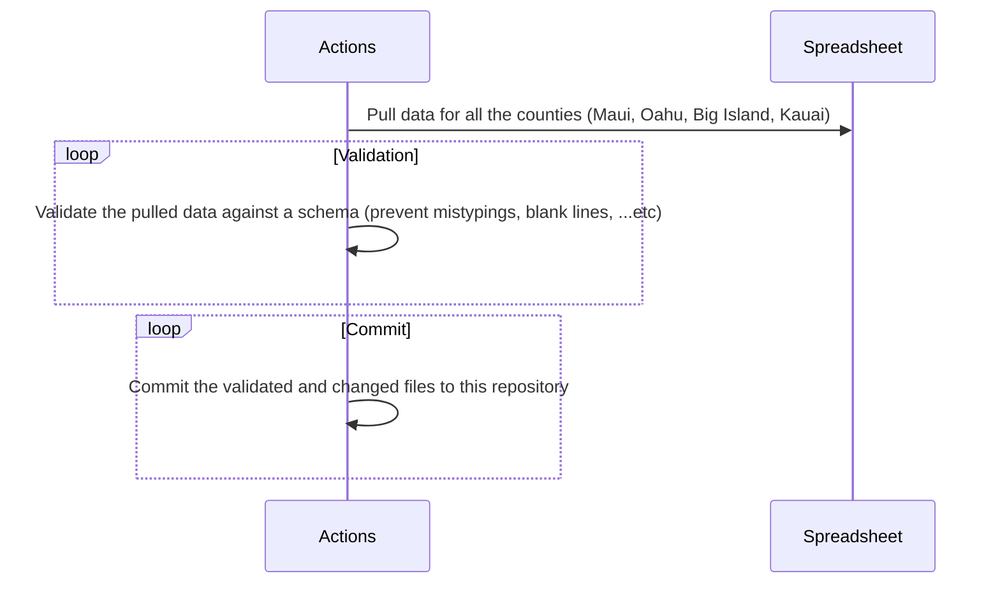
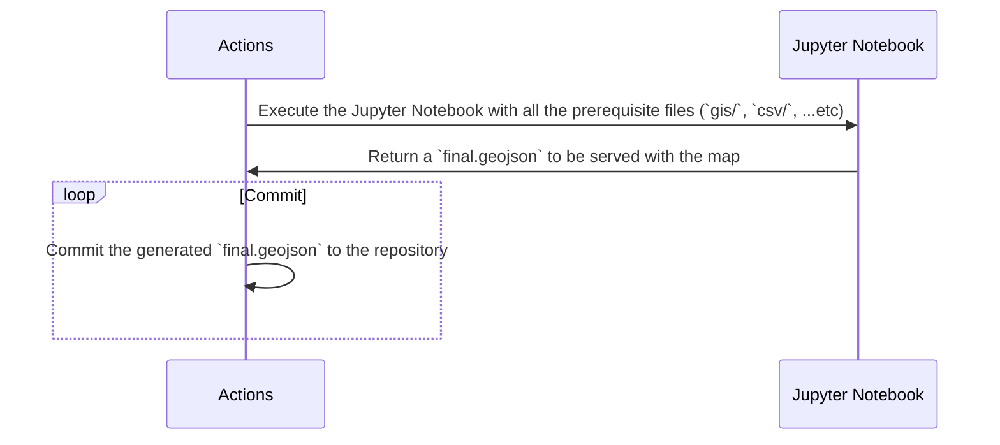

  

	:beach_umbrella: :volcano: :globe_with_meridians:

    
Interactive map showing how outdated zoning laws make it hard to build diverse, affordable housing in Hawaii

    <strong>Developed by Code with Aloha</strong>

  <h3>
  	<a href="https://hawaiizoningatlas.com">
      Official Website
    </a>
     | 
    <a href="https://github.com/CodeWithAloha/Hawaii-Zoning-Atlas/wiki">
      Wiki
    </a>
     | 
    <a href="#how-it-works">
      Refactored Website
    </a>
  </h3>

> Note: This project is mainly in maintenance mode, and we are not actively developing new features. We are still maintaining the project and fixing bugs. If you are interested in contributing into issues similar to this project (doing things such as statistical analysis and data visualization), contact Trey Gordner at hawaiizoningatlas@gmail.com.

### Philosophy

This interactive map shows how outdated zoning laws make it hard to build diverse, affordable housing, and the provided Jupyter Notebooks are meant to help gain insights into the data (statistical analysis, data visualization, etc).

Zoning laws, adopted by thousands of local governments across the country, dictate much of what can be built in the United States.  We need to find better ways of helping people understand what zoning codes say, because they have a tremendous impact on our economy, on the environment, and on our society.  A zoning atlas that enables users to visualize the prevalence and nature of regulatory constraints, particularly on housing, can be an important tool to achieve that goal.

### Partners, Supporters, and Sponsors

- [National Zoning Atlas](https://www.zoningatlas.org/)
- [Mercatus Center](https://www.mercatus.org/)
- Faith Action Hawaii

Our data, and many of the other states is also live on the [National Zoning Atlas's Atlas](https://www.zoningatlas.org/atlas).

### Resources

- [Measuring the Burden of Housing Regulation in Hawaii:](https://uhero.hawaii.edu/wp-content/uploads/2022/04/MeasuringTheBurdenOfHousingRegulationInHawaii.pdf) An April 2022 brief from UHERO, the economic research organization at the University of Hawaii, estimating that Hawaii has the most burdensome regulatory barriers of any state.
- [How Light Touch Density Can Address Hawaii’s Housing Shortage:](https://www.aei.org/research-products/report/how-light-touch-density-can-address-hawaiis-housing-shortage-examples-from-the-real-world/) Examples from the Real World: A report from the American Enterprise Institute applies lessons from other jurisdictions to Hawaii's unique context, proposing high-density transit-oriented development
- [Priced Out of Paradise:](https://hiappleseed.org/publications/priced-out-of-paradise/)  2018 report from Hawaii Appleseed addressing some of Hawaii's unique housing challenges: out of state ownership, investor speculation, and the proliferation of vacation rental units.
- [Introduction to Hawaii&#39;s Land Classification and Management System:](http://www.oha.org/wp-content/uploads/HRDC-LUTPManual_PRF6_FINAL.pdf) An official 76-page guide for residents written by state agencies and last updated in 2015.
- [Regulating Paradise:](https://scholarspace.manoa.hawaii.edu/bitstream/10125/24147/Callies%20-%20Regulating%20Paradise.pdf) A full-length 2010 book detailing key aspects of Hawaii land use law, including state and local planning, environmental regulations, and public lands.
- [ALOHA Homes: An Innovative Solution to Hawaii&#39;s Housing Shortage:](https://www.youtube.com/watch?v=8eTQLZYDUeM) State Sen. Stanley Chang, Chair of the Housing Commitee, has proposed numerous policy innovations aimed to address the housing crisis. ALOHA Homes is his flagship proposal for social housing.
- [Hawaii Zoning Atlas Reveal - Jan 2024](https://youtu.be/1BLN3iTP4zs)
- [The Role of Zoning in Hawai'i's Housing Crisis - Feb 15, 2024](https://youtu.be/mkSZ05W9JAk?si=VRJdRg6-pYstxUpn)

### News Articles

- https://www.hawaiifreepress.com/Articles-Main/ID/39670/Hawaii-Zoning-Atlas-Reveals-where-and-how-Zoning-Rules-Limit-Housing-Supply-and-Increase-Costs
- (Around `~17:00`) https://www.hawaiipublicradio.org/podcast/the-conversation/2023-08-11/the-conversation-climate-change-and-natural-disasters-hawai%CA%BBi-zoning-atlas-helps-with-housing
- https://www.civilbeat.org/2022/06/this-group-is-trying-to-make-sense-of-hawaiis-regulatory-landscape/
- https://www.civilbeat.org/2022/09/a-tremendous-need-for-affordable-housing-in-hawaii-leads-to-long-waitlists/

### New Developers Start Here

The code can be seen live at [hawaiizoningatlas.com](https://hawaiizoningatlas.com)

The process of moving the data from the starting point (the datasheet) to the final destination (the website) involves a series of processes that we are hoping to automate.

#### Data Pipeline

The goal of the data pipeline is to help decrease the friction between getting data from the spreadsheet to the final form hosted by the website.

In the [HZA Research Guide](https://github.com/CodeWithAloha/Hawaii-Zoning-Atlas/wiki/Research-Guide) The user can find the starting point for the map which is the [datasheet](https://docs.google.com/spreadsheets/d/1YGt_Y70oy6qc09ZZ7kip9DM2JGtRC2fAHxi6JXOIsSk/edit#gid=0).

This datasheet is manually populated by people going through the various zoning laws (The links for the zoning laws are found in the repo's research guide.) and filling out cells according to the guidelines laid out in [How to Make a Zoning Atlas](https://www.zoningatlas.org/how).

After the data sheet is populated, it is then exported to a csv where the following steps need to occur:

* The county tabs are combined together
* Validation is run on the data
* The final csv is given the name `hawaii-zoning-data.csv`

The `hawaii-zoning-data.csv` file should then be placed into the data-pipeline folder.

In the data-pipeline folder there is a "gis" folder that holds the output of processing various shape files. These shape files come from the maps given in the [HZA Research Guide](https://github.com/CodeforHawaii/Hawaii-Zoning-Atlas/wiki/Research-Guide). The method of processing the shape files is outlined in [How to Make a Zoning Atlas](https://www.zoningatlas.org/how).

#### Data Processing

1. Open the shape file in the GIS software of your choice, [QGIS](https://qgis.org/en/site/) has been used for this. 

2. Verify the following feature columns are added in addition to the existing columns **and match the spreadsheet values**
    * Jurisdiction
    * State
    * FullDistrictName 

    Note:
    **Do not change the geometry columns**

3. Export the result into a gpkg file (This will get read in by the CombineJurisdictions notebook)

Once the data has been aggregated and in the correct form, it is processed by the CombineJurisdictions Jupyter Notebook. The notebook exports the final.geojson file that is placed in the repository's "data" directory. This is the data the populates the website.

#### Automation Goals

[GitHub Actions](https://github.com/features/actions) is the tool we are using to automate the various parts of the data processing pipeline.

Different GitHub actions will perform the following tasks:

* Pull the data from the datasheet into a csv that combines the counties
* Run validation to ensure that the data is correct (prevent mistypings, blank lines, etc)
* Commit the validated and changed files to the repository

Once the data is ready for processing, another set of actions will perform the following tasks:

* Run the data through the `CombineJurisdiction` notebook
* Minimize the `final.geojson` file
* Commit the `final.geojson` file to the repository
  * The name of the `final.geojson` should include a timestamp and a reference to the original data used to generate it. This will allow us to rollback to different versions if needed.

## How It Works
Deployed on Netlify: [hawaiizoningatlas.netlify.app](https://hawaiizoningatlas.netlify.app)

Our research team read the complete zoning codes of all four counties and recorded which kinds of housing each zoning district allows, and under what rules, following the National Zoning Atlas's method. A Python notebook joins that spreadsheet to each county's zoning map, subtracts federal and state land (which counties can't zone), and writes a single GeoJSON file. The website draws that file on a Leaflet map. Choose a housing type, and every district that doesn't allow it turns gray. Click a district to see how much of its county's zoned land meets your filters.

### Features
* Static webpage deployed on Netlify
* Responsive to mobile viewports: on phones, the filters sit in a scrolling panel under the map
* Interactive Leaflet map of every zoning district in Hawaiʻi's four counties, colored by type: primarily residential, mixed with residential, or nonresidential
* Filters for 1-family, 2-family, 3-family, and 4+-family housing and accessory dwelling units (ADUs), by approval process, minimum lot size, minimum unit size, elderly-only housing, and ADU rules
* County area calculator: click a district to see how many acres, and what share of its county's zoned land, meet your filters
* A Clear filters button that resets the housing filters and the selected county, and leaves your overlays on
* County stats from the Census Bureau's 2020–2024 American Community Survey: median household income, Native Hawaiian residents, and cost-burdened households
* Overlays for waterways, federal lands, state lands, Hawaiian Home Lands (DHHL), rail stations with half-mile circles, and State House and Senate districts
* House and Senate district labels that appear as you zoom in and never overlap
* Overlays that download only when they're first turned on, with loading and error messages
* Map data trimmed to half its original size, so the map loads in under half the time
* Shareable links that save the map view and every filter, and ignore anything that doesn't match a real filter
* Map and satellite basemaps, plus a zone opacity slider
* Hover tooltips with each district's name, county, and the start of the researchers' notes. Click a district for its full notes in the county panel; on phones, a tap shows them there instead of a tooltip
* Spreadsheet and link text rendered as text, never as HTML, to prevent cross-site scripting (XSS)
* A guided intro tour that shows only on the first visit
* County stats generated from the Census API by a Node script, so the API key never reaches the browser
* Data pipeline in Python that joins the research spreadsheet to each county's GIS zoning map
* Weekly GitHub Actions sync that pulls the research spreadsheet, rebuilds and checks the map data, and deploys any changes

### Technologies

### Full Breakdown

This is a rebuild of [Code with Aloha's Hawaii Zoning Atlas](https://github.com/CodeWithAloha/Hawaii-Zoning-Atlas) on its original static stack. Nothing in the app needs a server: the data is processed ahead of time, and Netlify serves plain HTML, CSS, and JavaScript.

#### The research

Our research team read each county's zoning code and filled in a spreadsheet with one row per zoning district, following the National Zoning Atlas's [How to Make a Zoning Atlas](https://www.zoningatlas.org/how). Each row records:

- whether 1-family, 2-family, 3-family, and 4+-family housing and ADUs are allowed as of right, allowed only after a public hearing, or prohibited
- each housing type's minimum lot size, setbacks, parking, height limit, and minimum unit size
- whether housing is limited to elderly or affordable units, and how ADUs are restricted (owner occupancy, renters, size)

The county tabs are combined into [data-pipeline/hawaii-zoning-data.csv](data-pipeline/hawaii-zoning-data.csv). Each county's zoning map is prepared in **QGIS** and saved as a GeoPackage in [data-pipeline/gis/](data-pipeline/gis/).

#### The data pipeline

The **Jupyter** notebook [CombineJurisdictions.ipynb](data-pipeline/CombineJurisdictions.ipynb) turns the spreadsheet and the maps into the one file the website reads:

1. Reads each county's map with **GeoPandas** and merges every polygon of the same district into one shape
2. Gives each district an ID built from its state, county, and district name (Maui's `P-1` becomes `HI--MAUI--P1`), which links the map to its spreadsheet row
3. Measures each district in an equal-area projection (EPSG:6933), then subtracts federal and state land, which counties can't zone. What's left is the district's zoned acreage (`MA`), which the area calculator adds up
4. Turns the spreadsheet's answers into filter values with **pandas**. For example, minimum lot sizes are grouped into five ranges, from none to 1.84+ acres
5. Shortens the column names and values to keep the file small (`1-Family Treatment: Allowed/Conditional` becomes `1F: A`), simplifies the shapes to within about 2 m, and snaps every point to a 1 m grid. [shrink_geojson.py](data-pipeline/shrink_geojson.py) then writes `final.geojson` without extra digits or spaces, and it's copied to [data/final.geojson](data/final.geojson)

Every Monday, a **GitHub Actions** workflow ([spreadsheet.yml](.github/workflows/spreadsheet.yml)) keeps the map in sync with the spreadsheet:
- [pull_sheet.py](data-pipeline/pull_sheet.py) reads the sheet without editing it, and fixes a few known problems on the way in.
- If anything changed, the workflow reruns the notebook.
- [check_data.py](data-pipeline/check_data.py) then confirms that every county and every filter still works.
- Finally, the workflow commits the new data with a plain-language list of what changed, and Netlify deploys it. If any check fails, nothing is pushed.

#### The website

[index.html](index.html) holds the sidebar and the map, and [scripts/map.js](scripts/map.js) does the rest with **Leaflet** and **jQuery**. **Tachyons** classes handle the layout.

- **Loading:** `loadMapData()` fetches the county outlines and the zoning districts in parallel. A status message shows until they arrive, or explains the error if they don't
- **Filters:** each checkbox's `name` is a property in `final.geojson`, and its `value` is one accepted answer (`name="1F" value="AH"` means 1-family housing allowed only after a public hearing). A district keeps its color only if it matches every checked group; otherwise it turns gray
- **Area calculator:** clicking a district selects its county. The panel adds up the zoned acres of that county's matching districts, shows them as a share of the county's total, and lists the county's Census stats from [data/demographics.js](data/demographics.js)
- **Overlays:** each overlay downloads the first time it's turned on and stays cached after that, so the 11 MB waterways file only loads for visitors who ask for it. A status line reports loading and errors
- **District labels:** each House and Senate label sits at the center of its district's largest piece, or in the widest part of the shape when that center falls outside it. After every zoom, labels are placed largest district first, and each one shows only if its district has room for it on screen and it doesn't overlap another label
- **Shareable links:** the map view and every filter are saved in the URL (`#zoom/lat/lng/filters`) with `URLSearchParams`. Opening a link restores only values that match a real checkbox, and a link with junk in it gets rewritten
- **Safe rendering:** tooltips and panels are built from text nodes (`createTextElement()`), never from HTML strings, so text from the spreadsheet or a link can't run as code
- **Basemaps:** CARTO's light basemap or Esri satellite imagery, with CARTO's place names drawn above the zoning districts. There's one CARTO API key for local development and another for the live site
- **Analytics:** Google Analytics loads from [scripts/analytics.js](scripts/analytics.js) and skips local visits
- **Intro tour:** **Driver.js** walks first-time visitors through the map, and a localStorage flag keeps it from showing again
- **Phones:** at 600px wide and below, the map takes the top of the screen, and the sidebar becomes a scrolling panel underneath. Phones also open zoomed out, with every county in view

#### County stats

[tools/fetchDemographics.js](tools/fetchDemographics.js) is a **Node.js** script (built-in `fetch`, no packages) that pulls each county's numbers from the Census Bureau's API and writes them to `data/demographics.js`:

- median household income (table DP03)
- the share of residents who identify as Native Hawaiian (DP05)
- the share of households spending 30% or more of their income on housing (DP04)

It finds each value by its label, because the Census Bureau renumbers variables between releases. Its `--check` mode compares the site's numbers against several releases and definitions, which showed that the original numbers mixed two releases. The API key stays in `.env` and never reaches the browser.

#### Running it

| Command | What it does |
|---|---|
| `python -m http.server 8000` | Serves the site at http://localhost:8000. The map's data can't load from `file://` |
| `node --env-file=.env tools/fetchDemographics.js --check` | Shows which Census release and definitions match the current county stats, without writing anything |
| `node --env-file=.env tools/fetchDemographics.js 2024` | Rewrites `data/demographics.js` from the 2020–2024 release. Needs `CENSUS_API_KEY` in `.env` (see `.env.example`) |
| `python pull_sheet.py` (from `data-pipeline/`) | Pulls the spreadsheet into `hawaii-zoning-data.csv` and lists what changed |
| `jupyter execute CombineJurisdictions.ipynb` (from `data-pipeline/`) | Rebuilds `final.geojson` from the spreadsheet CSV and the county maps. The full steps are in [data-pipeline/README.md](data-pipeline/README.md) |
| `python check_data.py` (from `data-pipeline/`) | Checks the rebuilt map data before you commit it |

#### What's changed in this rebuild

- **Safe rendering:** district data and link text are inserted as text, never parsed as HTML, so nothing from the spreadsheet or a shared link can run as code
- **Validated links:** shared links restore only values that match a real filter, and junk gets cleaned out of the URL
- **Google Analytics:** moved into its own file. The map's `dataLayer` variable was renamed `zonesLayer`, because it was overwriting Google Analytics' own `dataLayer`
- **Basemap keys:** added after CARTO started requiring API keys in September 2026, which had replaced every map tile with an error image
- **County stats:** refreshed to the 2020–2024 Census estimates by a script. The old numbers mixed two releases
- **Intro tour:** shows once instead of on every visit
- **Overlays:** download when turned on instead of all at once on every visit, with loading and error messages
- **District labels:** House and Senate districts are labeled on the map, replacing popups that could never open
- **Data pipeline:** the public-hearing, ADU, and minimum unit size filters now match the data, and 7 districts that showed as Not Zoned now have their names
- **Mobile layout:** phones get the map above a scrolling filter panel, and on tablets the area panel no longer slides under the sidebar
- **Clear filters:** the button now also clears the county from the URL, leaves the overlays on, shows only when there's something to clear, and works from the keyboard
- **Selected county:** outlined in thick cyan above the House and Senate lines, where it used to be a thin yellow line that blended into the Senate districts
- **Spreadsheet sync:** the GitHub Action that pulls the research spreadsheet works again, weekly. It now also rebuilds the map data, checks it, and deploys it
- **District notes:** the researchers' Special Notes now show for 161 districts, including why Hawaiʻi County's farm districts count 1-family homes as prohibited
- **Phones:** no tooltips covering the small map, and tapping a district never zooms out
- **Smaller map data:** the zoning file is half its old size (25.4 → 12.6 MB, or 8.6 → about 3.2 MB as sent), so the map loads in 3.6 s instead of 8.5 s on a 10 Mbps connection. The county outlines and the rail line shrank too, and the map looks the same

#### Up next

- Semantic HTML and accessibility
- Replace Tachyons with plain CSS
- A mobile drawer: a button to hide and show the filter panel on phones
